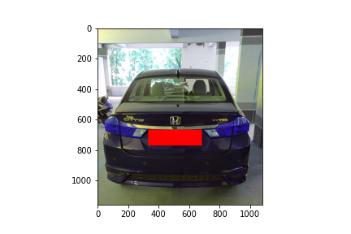
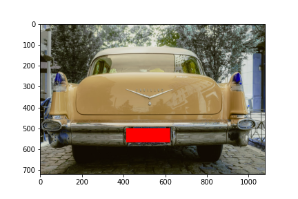
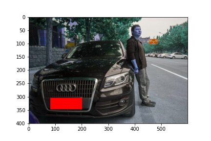
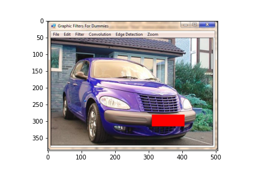

# License Plate Detection
This implementation is based on [EfficientDet](https://arxiv.org/pdf/1911.09070.pdf) for object detection on Keras and Tensorflow. 
This project is heavily based on https://github.com/xuannianz/EfficientDet

## About pretrained weights
Download Pretrained from <a href='https://drive.google.com/open?id=1lf4FyqTo1OYA8dyKnD_Bu9p-mlJJyVip'> here </a>

Thanks for their hard work.
This project is released under the Apache License. Please take their licenses into consideration too when use this project.

## Working 

Run Inference.ipynb and replace images with your images

## Results 
</img>
</img>
</img>
</img>
